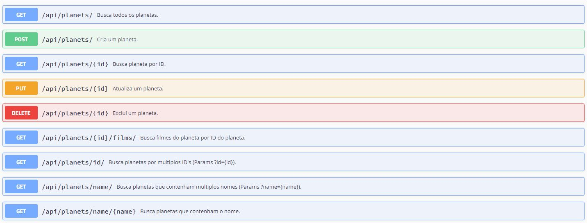

<div align="center">
<h1>API B2WStarWars</h1>

<h3>API de planetas da maior série de todos os tempos - Star Wars</h3>

<h3><a href="https://b2wstarwars.herokuapp.com/">https://b2wstarwars.herokuapp.com/</a></h3>
</div>
<hr>

## Índice

- [Introdução](#introdução)
- [Tecnologias](#tecnologias)
- [Usando a API](#usando-a-api)
- [Models e Retornos](#models-e-retornos)
- [HATEOAS](#hateoas)
- [Instalando a API](#instalando-a-api)
- [Direitos](#direitos)

# Introdução

A API B2WStarWars é uma API RESTful feita exclusivamente para localizar planetas da série Star Wars com suas condições como clima, terreno e também os filmes em que apareceram. Existe vários modos de localizar um planeta, vamos falar de cada um deles, você também pode com a ajuda do Swagger facilmente fazer as operações CRUD da API. As informações gravadas foram obtidas pelo Star Wars API: [https://swapi.co/](https://swapi.co/).

# Tecnologias

- [Java 11](https://www.oracle.com/technetwork/java/javase/downloads/index.html)
- [Spring Boot](https://spring.io/projects/spring-boot)
- [Mongo Cloud Atlas](https://www.mongodb.com/cloud/atlas)
- [Spring HATEOAS](https://spring.io/projects/spring-hateoas)
- [Thymeleaf](https://www.thymeleaf.org/)
- [Lombok](https://projectlombok.org/)
- [Swagger 2.9.2](https://swagger.io/)
- [Maven](https://maven.apache.org/)
- [Heroku Cloud Services](https://www.heroku.com/home)

# Usando a API

A API B2WStarWars pode ser usada de algumas formas através do formato JSON. Você pode usar o Swagger que está no Heroku [https://b2wstarwars.herokuapp.com/](https://b2wstarwars.herokuapp.com/) clicando no link principal ["Confira nosso Swagger"](https://b2wstarwars.herokuapp.com/swagger-ui.html).

Pelo Swagger é possível usar todas as funcionalidades que a API fornece.

- Recuperar todos os planetas
- Recuperar um planeta por ID
- Recuperar uma lista de planetas que contenham vários ID's
- Recuperar um planeta por nome
- Recuperar um planeta que contenha o nome
- Recuperar uma lista de planetas que contenham vários nomes
- Recuperar os filmes em que o planeta apareceu
- Criar um planeta
- Atualizar um planeta
- Deletar um planeta



Vamos abordar também outra maneira de conhecer a API usando o cURL ou Request URL para métodos GET.

#### Recuperar todos os planetas

URL: https://b2wstarwars.herokuapp.com/api/planets/

```shell
curl -X GET "https://b2wstarwars.herokuapp.com/api/planets/" -H "accept: */*"
```

A API retornará:
```json
HTTP/1.1 200 OK

[
  {
    "id": "5e1ca3711c9d440000fe53d3",
    "name": "Endor",
    "climate": "temperate",
    "terrain": "forests, mountains, lakes",
    "films": [
      {
        "title": "Return of the Jedi"
      }
    ],
    "filmsAppearances": 1,
    "links": [
      {
        "rel": "self",
        "href": "https://b2wstarwars.herokuapp.com/api/planets/5e1ca3711c9d440000fe53d3",
        "type": "GET"
      },
      {
        "rel": "films",
        "href": "https://b2wstarwars.herokuapp.com/api/planets/5e1ca3711c9d440000fe53d3/films/",
        "type": "GET"
      },
      {
        "rel": "update",
        "href": "https://b2wstarwars.herokuapp.com/api/planets/5e1ca3711c9d440000fe53d3",
        "type": "PUT"
      },
      {
        "rel": "delete",
        "href": "https://b2wstarwars.herokuapp.com/api/planets/5e1ca3711c9d440000fe53d3",
        "type": "DELETE"
      }
    ]
  },...
```

#### Recuperando um ou mais planetas por ID
A API B2WStarWars permite a busca de um único planeta, caso queira buscar mais de um planeta deve ser acrescentando no path `/id/` e a passagem de ID's nos parâmetros da URL `?id={id}&id=...`.

- Recuperar um único planeta por ID
URL: https://b2wstarwars.herokuapp.com/api/planets/{id}
```shell
curl -X GET "https://b2wstarwars.herokuapp.com/api/planets/5e1c99ec1c9d440000fe53cc" -H "accept: */*"
```

- Recuperar múltiplos planetas por ID's
URL: https://b2wstarwars.herokuapp.com/api/planets/?id={id}&id={id}
```shell
curl -X GET "https://b2wstarwars.herokuapp.com/api/planets/id/?id=5e1cb0691c9d440000fe53da&id=5e1cb2a91c9d440000fe53e3" -H "accept: */*"
```

A API retornará:
```json
HTTP/1.1 200 OK
[
   {
      "id":"5e1cb0691c9d440000fe53da",
      "name":"Kashyyyk",
      "climate":"tropical",
      "terrain":"jungle, forests, lakes, rivers",
      "films":[
         {
            "title":"Revenge of the Sith"
         }
      ],
      "filmsAppearances":1,
      "links":...
   },
   {
      "id":"5e1cb2a91c9d440000fe53e3",
      "name":"Rodia",
      "climate":"hot",
      "terrain":"jungles, oceans, urban, swamps",
      "films":[

      ],
      "filmsAppearances":0,
      "links":...
   }
]
```
#### Recuperando um ou mais planetas por Nome

Para fazer uma busca de planetas na API B2WStarWars por nome, devemos acrescentar no path `/name/`. A busca por nome pode ser pelo nome inteiro ou por parte do nome que deseja buscar.

Imagine que queira buscar o planeta chamado "Kashyyyk"

- Recuperar planeta por nome
URL: https://b2wstarwars.herokuapp.com/api/planets/name/{name}
```shell
curl -X GET "https://b2wstarwars.herokuapp.com/api/planets/name/Kashyyyk" -H "accept: */*"
```
Também pode ser consultado por "ashy" ou "AsHy", não faz diferença, nós tratamos casos como case sensitive pra você ;)
```shell
curl -X GET "https://b2wstarwars.herokuapp.com/api/planets/name/AsHy" -H "accept: */*"
```

- Recuperar múltiplos planetas por nome
URL: https://b2wstarwars.herokuapp.com/api/planets/name/?name={name}&name={name}
```shell
curl -X GET "https://b2wstarwars.herokuapp.com/api/planets/name/?name=kas&name=dor" -H "accept: */*"
```
A API retornará:
```json
HTTP/1.1 200 OK
[
  {
    "id": "5e1cb0691c9d440000fe53da",
    "name": "Kashyyyk",
    "climate": "tropical",
    "terrain": "jungle, forests, lakes, rivers",
    "films": [
      {
        "title": "Revenge of the Sith"
      }
    ],
    "filmsAppearances": 1,
    "links": ...
  },
  {
    "id": "5e1ca3711c9d440000fe53d3",
    "name": "Endor",
    "climate": "temperate",
    "terrain": "forests, mountains, lakes",
    "films": [
      {
        "title": "Return of the Jedi"
      }
    ],
    "filmsAppearances": 1,
    "links": ...
  },
  {
    "id": "5e1cbe9049fbe80eb42ad551",
    "name": "Dorin",
    "climate": "temperate",
    "terrain": "unknown",
    "films": [],
    "filmsAppearances": 0,
    "links": ...
  }
]
```

#### Recuperar os filmes em que o planeta apareceu

E se precisar saber somente quais filmes aquele planete apareceu? Tudo bem, use o ID do filme mais o path `/films/`


URL: https://b2wstarwars.herokuapp.com/api/planets/{id}/films/
```shell
curl -X GET "https://b2wstarwars.herokuapp.com/api/planets/5e1cb0691c9d440000fe53da/films/" -H "accept: */*"
```
A API retornará:
```json
HTTP/1.1 200 OK

{
   "count":1,
   "films":[
      {
         "title":"Revenge of the Sith"
      }
   ],
   "_links":...
}

```
#### Criar um planeta

Para criar um planeta utilize o método POST e alguns parâmetros são obrigatórios, como nome, terreno e clima. Confira nosso [Model Planeta](#model-planeta) para usar o JSON corretamente com seus campos.

**Importante:** Caso não haja filmes para este planeta, tudo bem, você não precisa enviar o campo **"films"** a API **B2WStarWars** vai criar uma lista vazia para você. Mas se o seu JSON enviar o campo **"films"** para a API, certifique-se de que o campo **"title"** esteja preenchido, pois ele será validado.

Veja o objeto JSON que será passado
```json
{
  "name": "New Planet",
  "climate": "Hot",
  "terrain": "Sand",
  "films": [{"title": "New Film"}]
}
```

URL: https://b2wstarwars.herokuapp.com/api/planets/
```shell
curl -X POST "https://b2wstarwars.herokuapp.com/api/planets/" -H "accept: */*" -H "Content-Type: application/json" -d "{ \"name\": \"New Planet\", \"climate\": \"Hot\", \"terrain\": \"Sand\", \"films\": [ { \"title\": \"New Film\" } ]}"
```
A API retornará:
```json
HTTP/1.1 201 Created

{
  "id": "5e285e673070027fb0aa5c41",
  "name": "New Planet",
  "climate": "Hot",
  "terrain": "Sand",
  "films": [
    {
      "title": "New Film"
    }
  ],
  "filmsAppearances": 1,
  "_links": ...
}
```
#### Atualizar um planeta
Para atualizar um planeta é necessário utilizar o método PUT passando o ID do planeta a ser atualizado. As obrigatoriedades de cada campo permanecem, veja [Model Planeta](#model-planeta).

Veja o objeto JSON que será passado para atualização
```json
{
  "name": "Old Planet",
  "climate": "Cold",
  "terrain": "Snow",
  "films": [{"title": "Old Film"}]
}
```

URL: https://b2wstarwars.herokuapp.com/api/planets/{id}

```shell
curl -X PUT "https://b2wstarwars.herokuapp.com/api/planets/5e285e673070027fb0aa5c41" -H "accept: */*" -H "Content-Type: application/json" -d "{ \"name\": \"Old Planet\", \"climate\": \"Cold\", \"terrain\": \"Snow\", \"films\": [{\"title\": \"Old Film\"}]}"
```
A API retornará:
```json
HTTP/1.1 200 Ok

{
   "id":"5e285e673070027fb0aa5c41",
   "name":"Old Planet",
   "climate":"Cold",
   "terrain":"Snow",
   "films":[
      {
         "title":"Old Film"
      }
   ],
   "filmsAppearances":1,
   "_links":...
}
```
#### Deletar um planeta
Deletar um planeta é muito simples, basta passar o ID do planeta que você deseja destruir :boom:. Muhuhhahaha!

URL: https://b2wstarwars.herokuapp.com/api/planets/{id}

```shell
curl -X DELETE "https://b2wstarwars.herokuapp.com/api/planets/5e285e673070027fb0aa5c41" -H "accept: */*"
```
A API retornará:
```json
HTTP/1.1 204 No Content
```
## Falhas, erros e tratamentos
A API **B2WStarWars** responde e trata os erros comuns que podem acontecer no desenvolvimento da chamada a API. Como por exemplo erros de construção do JSON, campos inválidos e planetas não encontrados.

Ao ocorrer falhas ou erros de construção na chamada a API o retorno seguirá com a descrição do erro com uma mensagem e um campo de erro mais detalhado sobre o problema.

Veja alguns exemplos:

#### Criando um planeta passando um campo que não existe:
Passamos o campo "name123" quando deveria ser "name".

```shell
curl -X POST "https://b2wstarwars.herokuapp.com/api/planets/" -H "accept: */*" -H "Content-Type: application/json" -d "{ \"name123\": \"New Planet\", \"climate\": \"Hot\", \"terrain\": \"Sand\", \"films\": [ { \"title\": \"New Film\" } ]}"
```

A API retornará:
```json
HTTP/1.1 400 Bad Request

{  
	"message":  "A requisição possui formato inválido",  
	"code":  400,  
	"status":  "BAD_REQUEST",  
	"error":  "com.fasterxml.jackson.databind.exc.UnrecognizedPropertyException: Unrecognized field \"name123\" (class br.com.starwars.b2w.models.Planet), not marked as ignorable (5 known properties: \"id\", \"climate\", \"films\", \"name\", \"terrain\"])\n at [Source: (PushbackInputStream); line: 2, column: 15] (through reference chain: br.com.starwars.b2w.models.Planet[\"name123\"])"  
}
```
#### Criando um planeta passando um campo nulo ou vazio:
Passamos o campo "name"  com seu valor vazio "".

```shell
curl -X POST "https://b2wstarwars.herokuapp.com/api/planets/" -H "accept: */*" -H "Content-Type: application/json" -d "{ \"name\": \"\", \"climate\": \"Hot\", \"terrain\": \"Sand\", \"films\": [ { \"title\": \"New Film\" } ]}"
```

A API retornará:
```json
HTTP/1.1 400 Bad Request

{  
	"message":  "A requisição possui campos inválidos",  
	"code":  400,  
	"status":  "BAD_REQUEST",  
	"error":  "[Field error in object 'planet' on field 'name': rejected value []; codes [NotBlank.planet.name,NotBlank.name,NotBlank.java.lang.String,NotBlank]; arguments [org.springframework.context.support.DefaultMessageSourceResolvable: codes [planet.name,name]; arguments []; default message [name]]; default message [O nome do planeta não pode ser nulo ou vazio.]]"  
}
```
A API **B2WStarWars** faz o tratamento (Formatação JSON, campos nulos ou vazios) de erros para a criação e atualização dos planetas, portanto usando o método PUT para atualizar um planeta deixando erros na construção ou deixando campos inválidos incorrerá nos erros citados acima.

#### Planetas não encontrados
Ao usar a API **B2WStarWars** passando ID's ou nomes que não existem para serem consultados, atualizados ou excluídos o retorno também será passado de maneira amigável.

Buscando um planeta por ID inexistente:
```shell
curl -X GET "https://b2wstarwars.herokuapp.com/api/planets/notfound" -H "accept: */*"
```
Buscando um planeta por nome inexistente:
```shell
curl -X GET "https://b2wstarwars.herokuapp.com/api/planets/name/notfound" -H "accept: */*"
```
Atualizando um planeta com um ID inexistente:
```shell
curl -X PUT "https://b2wstarwars.herokuapp.com/api/planets/notfound" -H "accept: */*" -H "Content-Type: application/json" -d "{ \"name\": \"Old Planet\", \"climate\": \"Cold\", \"terrain\": \"Snow\", \"films\": [{\"title\": \"Old Film\"}]}"
```
Deletando um planeta com um ID inexistente:
```shell
curl -X DELETE "https://b2wstarwars.herokuapp.com/api/planets/notfound" -H "accept: */*"
```

A API retornará:
```json
HTTP/1.1 404 Not Found

{  
	"message":  "O planeta notfound não pode ser encontrado",  
	"code":  404,  
	"status":  "NOT_FOUND",  
	"error":  "br.com.starwars.b2w.exceptions.PlanetNotFoundException: O planeta notfound não pode ser encontrado"  
}
```
O tratamento acima é similar quando se busca um ID ou nome de planeta que não existe, quando se atualiza um planeta com um ID que não existe e quando deletamos um planeta que não existe.

# Models e Retornos

### Model Planeta
|Campo|Tipo|Descrição|Regras|
|:---|:---:|:---|:---:|
|`id`|str|ID do planeta|leitura
|`name`|str|Nome do planeta|obrigatório
|`climate`|str|Clima do planeta|obrigatório
|`terrain`|str|Terreno do planeta|obrigatório
|`filmsAppearances`|int|Número de aparições em filmes|leitura
|`films`|list|Lista de filmes onde o planeta apareceu|opcional
|`title`|str|Título do filme onde o planeta apareceu|obrigatório

### Model Filmes

|Campo|Tipo|Descrição|Regras|
|:---|:---:|:---|:---:|
|`count`|str|Quantidade de filmes da lista|leitura
|`films`|list|Lista de filmes onde o planeta apareceu|leitura
|`title`|str|Título do filme onde o planeta apareceu|leitura

### Retorno e Status Code
|Path|Método|Status|Code|Descrição|
|:---|:---:|:---:|:---|---|
|`/api/planets/`|`GET`| OK | 200 | Lista com todos os planetas |
|`/api/planets/{id}`|`GET`| OK | 200 |Recupera um planeta por ID|
|`/api/planets/id/?id={id}`|`GET`| OK | 200 |Recupera uma lista de planetas por múltiplos ID's|
|`/api/planets/name/{name}`|`GET`| OK | 200 |Recupera um planeta por nome|
|`/api/planets/name/?name={name}`|`GET`| OK | 200 |Recupera uma lista de planetas por múltiplos nomes|
|`/api/planets/{id}/films/`|`GET`| OK | 200 |Recupera uma lista de filmes por ID do planeta|
|`/api/planets/`|`POST`| CREATED | 201 |Cria um planeta|
|`/api/planets/{id}`|`PUT`| OK | 200 |Atualiza um planeta|
|`/api/planets/{id}`|`DELETE`|NO CONTENT| 204 |Deleta um planeta|

# HATEOAS
A API B2WStarWars implementa o controle de mídias HATEOAS (Hypermedia as the Engine of Application State) que é um componente da arquitetura de aplicativo REST que mantém a arquitetura de estilo RESTful.

Com esse estilo de arquitetura REST é permitido usar links de hipermídia no conteúdo da resposta, para que você possa navegar dinamicamente para o recurso apropriado percorrendo os links de hipermídia.

Nas respostas JSON é possível localizar o campo **"_links"** onde é feito o relacionamento de cada recurso buscado.

- self = auto relacionamento, ou onde a informação sobre o item se encontra especificamente.
- films = informações sobre filmes relacionados com o recurso.
- update = relacionamento com atualização do recurso.
- delete = relacionamento com deleção do recurso.

```json
HTTP/1.1 200 OK

{
   "id":"5e1cb0821c9d440000fe53dc",
   "name":"Mygeeto",
   "climate":"frigid",
   "terrain":"glaciers, mountains, ice canyons",
   "films":[
      {
         "title":"Revenge of the Sith"
      }
   ],
   "filmsAppearances":1,
   "_links":{
      "self":{
         "href":"https://b2wstarwars.herokuapp.com/api/planets/5e1cb0821c9d440000fe53dc",
         "type":"GET"
      },
      "films":{
         "href":"https://b2wstarwars.herokuapp.com/api/planets/5e1cb0821c9d440000fe53dc/films/",
         "type":"GET"
      },
      "update":{
         "href":"https://b2wstarwars.herokuapp.com/api/planets/5e1cb0821c9d440000fe53dc",
         "type":"PUT"
      },
      "delete":{
         "href":"https://b2wstarwars.herokuapp.com/api/planets/5e1cb0821c9d440000fe53dc",
         "type":"DELETE"
      }
   }
}
```
O HATEOAS permite que o servidor faça alterações no URI à medida que a API evolui sem interromper o desenvolvimento de outras aplicações.

Ou seja, os links representam o que pode ser feito em seguida, como essa busca feito acima, podemos concluir que você pode buscar mais dados deste planeta, atualizar ele ou até mesmo deletar este planeta.


# Instalando a API
É muito simples fazer deploy da API **B2WStarWars**, para isso precisamos fazer download do Java-11 e do Maven.

- [Java SE Development Kit 11.0.6](https://www.oracle.com/technetwork/java/javase/downloads/jdk11-downloads-5066655.html)
- [ Apache Maven 3.6.3](https://maven.apache.org/download.cgi)

Depois de instalar o Java e o Maven em seu ambiente confira se está tudo certo verificando a versão instalada.

```shell
$ mvn -v
```

Se estiver tudo certo com a instalação  você verá a versão do Maven e do Java.

A partir de agora vamos usar os **comandos do Maven** para compilar, executar os testes e fazer o deploy da nossa API em localhost.

### Empacotando o projeto
Após baixar o projeto no GitHub vá até a pasta do projeto onde existe o **"pom.xml"** e execute o comando de empacotamento `package`. Isso baixará as dependências do projeto e vai gerar o artefato para deploy.
```shell
$ mvn package
```
Isso pode demorar alguns segundos, já que estamos baixando todas as lib's do projeto.

### Executando os testes
O comando `test` no Maven, vai executar todas as rotinas de testes programadas no back-end da API.

```shell
$ mvn test
```

### Rodando a API
Finalmente após o empacotamento e geração de testes, podemos subir a nossa API em localhost. Para isso o comando necessário é:

```shell
$ mvn spring-boot:run
```
A aplicação será iniciada em localhost:8080

### Banco de dados
Estamos utilizando o nosso melhor MongoDB para guardar as informações. Não se preocupe em configurar nada, ele está na :cloud:nuvem:cloud:.

Curtiu? Espero que sim! ;D

# Direitos
Sob licença [MIT](https://github.com/PhillB2W/StarWars/blob/master/LICENSE).
